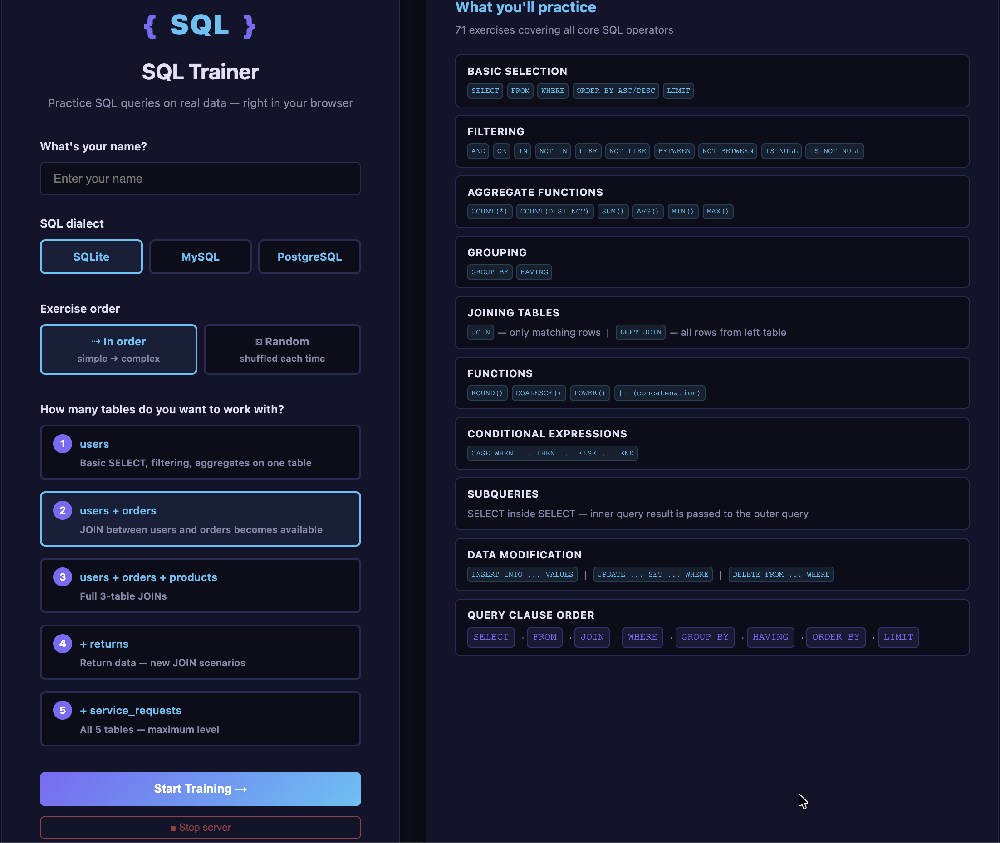
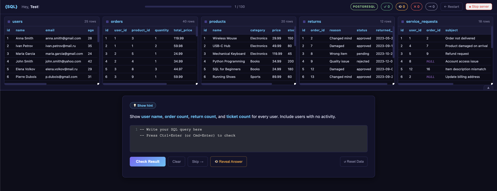

# SQL Query Practice Trainer

A local SQL trainer that runs in your browser. Practice real queries on a real database, no sign-up, no cloud.





## Quick Start

```bash
git clone https://github.com/burgano/SQL-query-practice.git
cd sql-query-practice
```

**macOS / Linux:**
```bash
bash run.sh
```

**Windows:**
```bat
run.bat
```

The script sets everything up automatically and opens the browser. No manual installation needed.

To stop the server use the **Stop server** button inside the app.

---

## Platform notes

### macOS
- Requires Python 3.8+ — [python.org](https://www.python.org/downloads/)
- Creates a virtual environment, installs dependencies, starts the server
- Browser opens automatically at `http://localhost:<port>`
- Port 5000 may be taken by AirPlay Receiver → the script finds the next free port automatically
  - To disable AirPlay: System Settings → General → AirDrop & Handoff → AirPlay Receiver → Off
  - Or specify a port manually: `PORT=8080 bash run.sh`

### Linux (Ubuntu / Debian)
- Requires Python 3.8+: `sudo apt install python3`
- `python3-venv` is installed automatically if missing (requires `sudo`)
- If the project is on an NTFS/exFAT drive (no symlink support), the virtual environment is created in `~/.local/share/sql-query-practice-venv` instead
- Browser opens automatically via `xdg-open` (requires a desktop environment)

### Windows
- Python is installed automatically if not found (via winget or direct download from python.org)
- Virtual environment and dependencies are set up automatically
- Browser opens automatically
- Port is selected automatically starting from 5000

## What's Inside

5 related tables with realistic data:

| # | Table | Description |
|---|-------|-------------|
| 1 | `users` | 25 users from different cities |
| 2 | `orders` | 40 orders |
| 3 | `products` | 20 products |
| 4 | `returns` | 12 returns |
| 5 | `service_requests` | 18 support tickets |

130 exercises covering:

- `SELECT / WHERE / ORDER BY / LIMIT`
- `AND / OR / IN / NOT IN / LIKE / BETWEEN / IS NULL`
- `COUNT / SUM / AVG / MIN / MAX`
- `GROUP BY / HAVING`
- `JOIN / LEFT JOIN`
- `ROUND / COALESCE / LOWER / concatenation`
- `CASE WHEN`
- Subqueries
- `INSERT / UPDATE / DELETE`
- Multi-table JOINs (3, 4, 5 tables)

## Features

- Choose SQL dialect: SQLite, MySQL or PostgreSQL
- Sequential or random exercise order
- 1 to 5 tables depending on what you want to practice
- Hint system hidden behind a button
- Reveal answer on demand
- Answer checked by comparing actual query results, not strings
- DML exercises reset the data before each check

## Stack

Python 3.8+ / Flask / SQLite / CodeMirror / Vanilla JS

## Project Structure

```
sql-query-practice/
├── app.py
├── database.py
├── exercises.py
├── run.sh
├── run.bat
├── assets/
├── static/
│   ├── style.css
│   └── script.js
└── templates/
    ├── welcome.html
    ├── trainer.html
    └── complete.html
```
